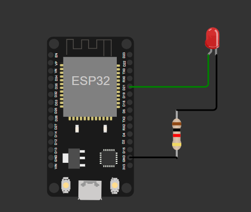

# Idea Lab Mini Project

This repository contains two mini projects developed for the Idea Lab during the second semester at **Mar Athanasius College of Engineering**, as part of the **AI and Machine Learning** program. The projects demonstrate the use of microcontrollers and web development to solve practical problems.

## Team Members

- **Ivan Raphel Jaison**  
- **Jeeva Hariprasad**  
- **Jess Johnson**  
- **Jesbin Shaju**

---

## Project 1: Microcontroller LED Binary Message Display

This project uses an **ESP32 microcontroller** to display a binary representation of a message using an LED. The LED blinks in a pattern corresponding to the binary encoding of the message.

### Features

- Converts text messages into binary format.
- Displays the binary sequence using an LED (ON for `1`, OFF for `0`).
- Implements delays for clear visibility of the binary pattern.
- Simulated on [Wokwi](https://wokwi.com).

### Simulation

You can view the simulation here:  
[Microcontroller LED Binary Message Display Simulation](https://wokwi.com/projects/429272500855864321)

### Components Used

- **ESP32 Microcontroller**: Executes the code and controls the LED.
- **LED**: Displays the binary sequence.
- **Resistor**: Limits current to the LED to prevent damage.

### How It Works

1. The microcontroller receives a string message.
2. The message is converted into its binary representation.
3. The LED blinks in a pattern corresponding to the binary sequence:
   - LED ON for `1`
   - LED OFF for `0`
4. A delay is implemented between each binary state for better visibility.

### Files

- `main.py`: Python code for the ESP32 microcontroller.
- `diagram.json`: Circuit layout for the project.
- `wokwi-project.txt`: Link to simulate the project on Wokwi.

---

## Project 2: Number System Converter Web Application

This project is a web-based application that allows users to convert numbers between different bases (binary, octal, decimal, hexadecimal). The application features a dark-themed UI with dropdowns for selecting the input and output bases.

### Features

- Supports base conversions between Binary (Base 2), Octal (Base 8), Decimal (Base 10), and Hexadecimal (Base 16).
- Real-time conversion as the user types.
- Displays an error message for invalid inputs.
- Dark-themed UI with a modern acrylic effect.

### How It Works

1. The user selects the "From" and "To" bases using dropdown menus.
2. The user enters a number in the input field.
3. The application validates the input and converts it to the selected base.
4. The result is displayed in real-time.

### Files

- `index.html`: HTML structure of the web application.
- `style.css`: CSS for the dark-themed UI with acrylic effects.
- `app.js`: JavaScript logic for real-time number conversion.

### Preview

To run the web application, open the `index.html` file in a browser.

---

## Repository Structure

- **`microcontroller/`**: Contains the microcontroller project files.
  - `main.py`: Python code for the ESP32 microcontroller.
  - `diagram.json`: Circuit layout for the project.
  - `wokwi-project.txt`: Link to simulate the project on Wokwi.
- **`webpage/`**: Contains the number system converter web application.
  - `index.html`: HTML structure of the web application.
  - `style.css`: CSS for the dark-themed UI.
  - `app.js`: JavaScript logic for the application.

---

## License

This project is licensed under the MIT License.